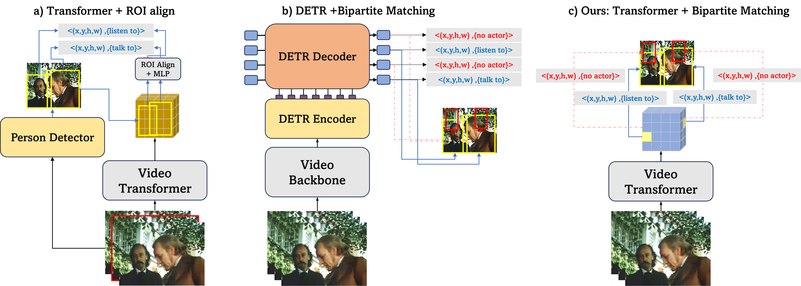

# Official PyTorch Implementation of BMViT

Official PyTorch implementation of the **[Multiscale Vision Transformers meet Bipartite Matching for efficient single-stage Action Localization](https://arxiv.org/pdf/2312.17686)**. If you use this code for your research, please [**cite**](#citation) our paper.


> **Multiscale Vision Transformers meet Bipartite Matching for efficient single-stage Action Localization**<br>
> Ioanna Ntinou*, Enrique Sanchez* and Georgios Tzimiropoulos<br>
> *Denotes equal contribution 
> <br>
> 
>
> **Abstract**: 

<p alighn="center">
Action Localization is a challenging problem that combines detection and recognition tasks, which are often addressed separately. State-of-the-art methods rely on off-the shelf bounding box detections pre-computed at high resolution and propose transformer models that focus on the classification task alone. Such two-stage solutions are prohibitive for real-time deployment. On the other hand, single-stage methods target both tasks by devoting part of the network (generally the backbone) to sharing most of the workload, compromising performance for speed. These methods build on adding a DETR head with learnable queries that, after cross- and self-attention, can be sent to corresponding MLPs for detecting a person’s bounding box and action. However, DETR-like architectures are challenging to train and can incur big complexity. In this paper, we observe that a straight bipartite matching loss can be applied to the output tokens of a vision transformer. This results in a backbone + MLP architecture that can do both tasks without needing an extra encoder decoder head and learnable queries. We show that a single MViT-S architecture trained with bipartite matching to perform both tasks surpasses the same MViT-S when trained with RoI align on pre-computed bounding boxes. With a careful design of token pooling and the proposed training pipeline, our MViTv2-S model achieves +3 mAP on AVA2.2. w.r.t. the two-stage counterpart.
</p>

## Notes:

Code to be released soon.

## Acknowledgements

This research utilised Queen Mary's Apocrita HPC facility, supported by QMUL Research-IT. http://doi.org/10.5281/zenodo.438045

## Citation
```bibtex
@inproceedings{ntinou2024multiscale,
    title={Multiscale Vision Transformers Meet Bipartite Matching for Efficient Single-Stage Action Localization},
    author={Ioanna Ntinou and Enrique Sanchez and Georgios Tzimiropoulos},
    booktitle={Proceedings of the IEEE/CVF Conference on Computer Vision and Pattern Recognition (CVPR)},
    year={2024},
}
```
